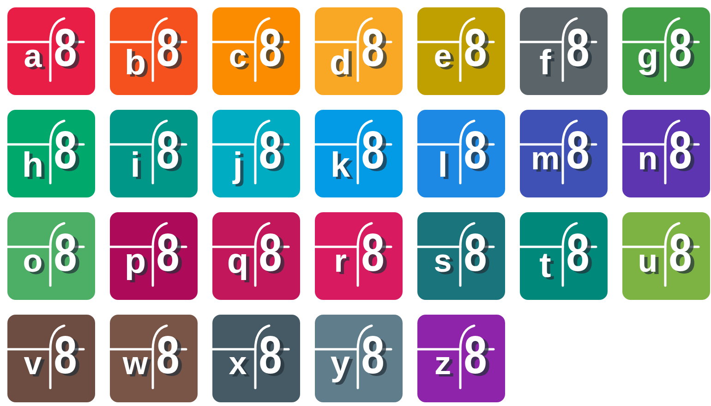
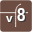
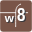
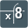
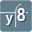

# 8 Visual Control

This file embeds the current icon outputs for visual review. The machine-readable
source of truth is [icon-spec.v1.json](icon-spec.v1.json).

## Full Preview

## Icon Matrix

| ID | Name | SVG | PNG 32 | PNG 192 | PNG 526 |
| --- | --- | --- | --- | --- | --- |
| `a8` | A8 |  |  |  |  |
| `b8` | Bild8 |  |  |  |  |
| `c8` | C8 |  |  |  |  |
| `d8` | D8 |  |  |  |  |
| `e8` | E8 |  |  |  |  |
| `f8` | Funktion8 |  |  |  |  |
| `g8` | G8 |  |  |  |  |
| `h8` | H8 |  |  |  |  |
| `i8` | I8 |  |  |  |  |
| `j8` | J8 |  |  |  |  |
| `k8` | K8 |  |  |  |  |
| `l8` | L8 |  |  |  |  |
| `m8` | M8 |  |  |  |  |
| `n8` | Notariat8 |  |  |  |  |
| `o8` | O8 |  |  |  |  |
| `p8` | P8 |  |  |  |  |
| `q8` | Q8 |  |  |  |  |
| `r8` | R8 |  |  |  |  |
| `s8` | S8 |  |  |  |  |
| `t8` | T8 |  |  |  |  |
| `u8` | U8 |  |  |  |  |
| `v8` | V8 |  |  |  |  |
| `w8` | W8 |  |  |  |  |
| `x8` | X8 |  |  |  |  |
| `y8` | Y8 |  |  |  |  |
| `z8` | Z8 |  |  |  |  |
